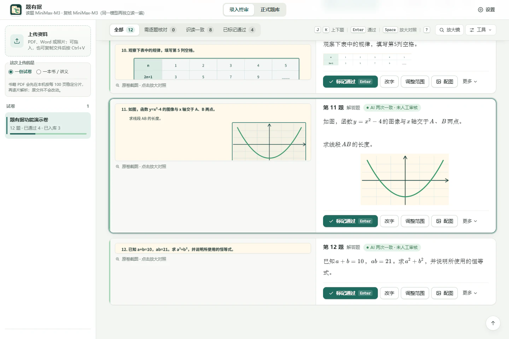
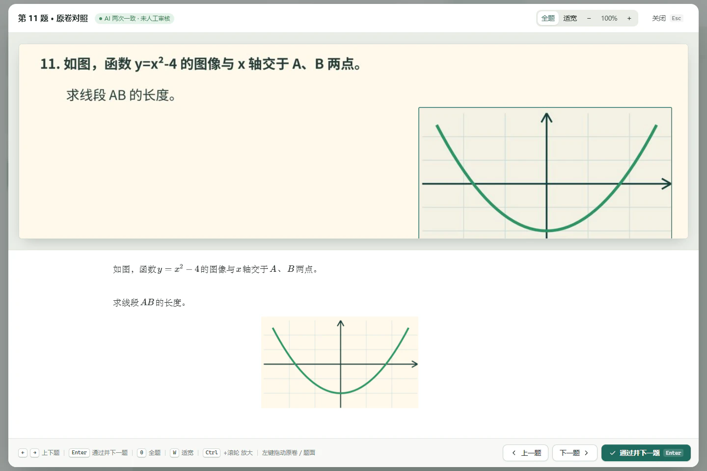
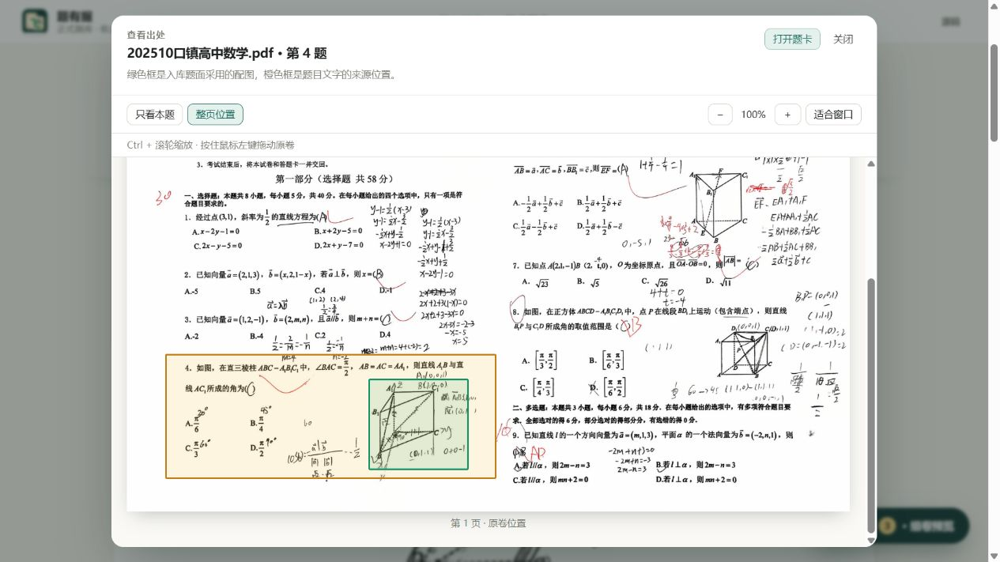
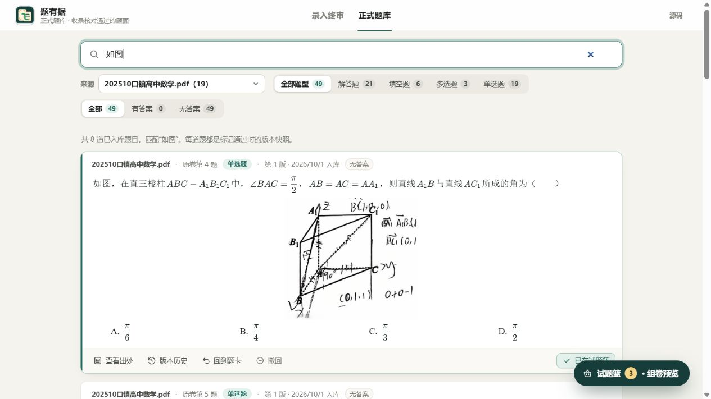
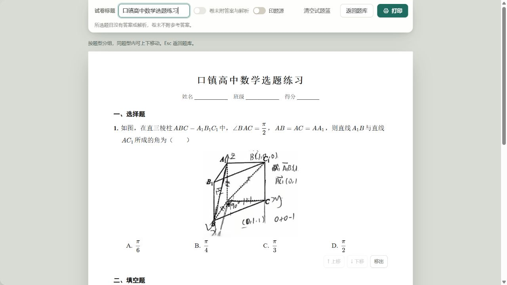

<p align="center">
  
</p>

<h1 align="center">题有据</h1>

<p align="center"><strong>每一道题，都能回到原卷。</strong></p>

<p align="center">
  装在自己电脑上的数学试题整理工具：把 PDF、Word 和手机拍的试卷，变成逐题核对过、能搜索、能组卷的题库。
</p>

<p align="center">
  <sub>关键词：数学题库软件 · 免费组卷 · 错题整理 · 试卷识别与切题 · PDF / Word / 拍照转题库 · 中小学老师 · 本地运行 · 开源免费</sub>
</p>

<p align="center">
  <a href="https://github.com/CEHNICA/question-bank-card/releases/latest"><strong>下载最新版</strong></a>
  ·
  <a href="#一份试卷是怎么变成题库的">看看怎么工作</a>
  ·
  <a href="#完全免费的配法">完全免费的配法</a>
  ·
  <a href="#让-ai-助手帮你用">让 AI 助手帮你用</a>
  ·
  <a href="#api-与隐私边界">隐私边界</a>
</p>

<p align="center">
  <a href="https://github.com/CEHNICA/question-bank-card/releases/latest"></a>
  <a href="https://github.com/CEHNICA/question-bank-card/actions/workflows/tests.yml"></a>
  
  <a href="LICENSE"></a>
</p>



本地实际界面：`202510口镇高中数学.pdf` 第 4 题，左边是带演算笔迹的原卷，右边是已整理的题面和配图。

## 这是什么

以下是源码的改进记录；可下载安装包的版本以 [Releases](https://github.com/CEHNICA/question-bank-card/releases) 为准。

1.10.12（2026-10-02）：原卷查看统一支持 Ctrl+滚轮围绕鼠标位置缩放，以及按住鼠标左键拖动。正式题库的“查看出处”可以缩小到 25%、放大到 400%，切换本题/整页或关闭窗口会结束拖动；缩放不重新载入图片。“适合窗口”会同时考虑宽度和高度。

“试卷操作 → 查看整份原卷”可只读翻页查看。调整范围、配图、框选识读时，左键仍然画框，空格+左键或中键拖动画布；画框过程中不会因 0/W 切换缩放而改变坐标。原卷图片加载失败会提示，避免对空白图片继续缩放。

1.10.11（2026-10-02）：修复快速连续修改读题模型时丢选择，保存失败可保留输入并重试；设置区分密钥配置与服务实际可用性。新增已归档试卷的查看、恢复和撤销归档。组卷会明确列出取不到的题目，处理前暂停打印；搜索失败说明当前是旧结果并提供重试。组卷预览支持完整的键盘焦点循环，长公式提示横向查看；打印按 A4 检查公式宽度，在顶层运算符处分行，不能保持清晰字号的公式会提示修改，避免静默裁切。

1.10.11 显示修正：普通短分数保持完整显示，不再出现多余的竖向滚动框；真正过宽的公式保留滑动和键盘提示，打印时移除预览焦点框。

1.10.10（2026-10-02）：改字预览显示当前输入或选中的位置；修改公式时框出对应公式，能安全定位的数字或字母会着绿。框选识读默认“自动推荐（AI）”，推荐题干或选项中的完整替换片段，显示替换前后，经确认只填入改字表单，仍由用户保存；无法定位、位置重复或题面已变化时保留识读文字并提供手动选择。实际 AI 识读准确率尚未实测；位置映射、推荐校验和交互使用离线数据验证。

1.10.10 样式修订：预览光标加粗并显示上下端点，文字选区增加底色与描边；公式蓝框加粗，对应数字或字母增加黄色底色和绿色描边，方便看清小指数。

1.10.9 的界面改进继续保留：改字未保存时离开会提醒；题库搜索无结果可一键清除筛选；组卷操作在窄窗口也完整显示，无答案或解析时省略卷末参考区。查看出处可只看本题、查看整页并放大。来源与版本历史窗口可查看其他资料中的相同题面，以及限定公式排版差异的待核对候选；每份资料保留自己的原卷和历史，不自动合并记录。

离线浏览器回归脚本在 `tools/check_edit_assistance_browser.py`、`tools/check_unsaved_browser.py`、`tools/check_library_preview_browser.py` 和 `tools/check_library_ux_browser.py`；运行前先看 `--help`。它们使用临时数据，不需要 MinerU，也不保存真实题库的题目。

老师手里总有一摞试卷：扫描的 PDF、别人发来的 Word、用手机拍的照片，上面常常还有学生的作答和红笔批改。想把这些题收进自己的题库，以后能搜、能挑、能组一份新卷子，最费劲的一步是把题目一道道敲进电脑：分式、根号、上下标、几何符号，还有配图。

题有据把这件事分成两半：

- **机器做得快的**：认版面、切出每一道题、看着截图把题目读成文字和公式、挑出配图、标出没把握的地方。
- **必须有人把关的**：对照原卷截图确认每一道题，错了就改，对了就打勾。可以是你自己，也可以是你信任的 AI 助手。AI 打的勾单独标出来，等你抽查。

打过勾的题才进入正式题库。每一道入库的题都带着它在原卷上的截图、谁核对的、改过什么。所以叫“题有据”。

它是一个本地软件：服务只在你自己的电脑上运行（`127.0.0.1`），题库、原卷和密钥都存在本机。读题时会用到你自己申请的第三方服务，这些服务都可以选免费的，见[完全免费的配法](#完全免费的配法)。

## 一份试卷是怎么变成题库的

```
导入原卷 → 切题 → 读题（两次识读 + MinerU 旁证）→ 逐题核对 → 入库 → 搜索、选题、组卷打印
```

1. **导入**：拖进 PDF、Word，或几张照片（合成一份试卷）；也可以复制文件后直接粘贴。一本书或讲义选“一本书 / 讲义”，长资料在本机按页分片，失败的分片可以单独重跑。
2. **切题**：[MinerU](https://mineru.net) 识别整页版面和文字，题有据在本机按题号切出每道题在原卷上的范围，并找出可能是配图的地方。手机拍的卷子，切线会避开字、落在两行之间的空白里；学生写在栏顶的演算不会当成题目的续页拼进来。
3. **读题**：看图模型把每道题的截图读成文字，公式写成 LaTeX，表格写成文字表，学生手写和批改按要求忽略。每道题都和 MinerU 自己认出的文字逐字比对；对不上就请另一个模型独立再读一遍，有分歧的地方逐处裁定。
   - 题型（单选、多选、填空、判断、解答）一起读出来；大题说明写着“有多项符合题目要求”的，按多选题记。
   - 题干前面印的出处，比如“（2025·北京海淀·期中）”，单独放进“题源”，不算题干。
4. **核对**：每道题一张题卡，左边原卷截图，右边读出来的题面。
   - **绿卡**：两次识读一致，或与 MinerU 的文字一致。这不等于读对了，仍要你按自己的标准确认。
   - **黄卡**：有疑点，比如两次读法不同、可能漏图、配图冲突、有看不清的字。疑点会直接写在卡上；和 MinerU 读法不同的字，在原卷截图上用编号虚线框标出那一行，在题面上标出那个字。
   - **红卡**：没读出来，需要改字或重读。
   - 题型没读出来的题是黄卡，在题号旁边选好题型才能打勾。

   改字时边打字边排版预览，预览中的绿线或公式框提示正在修改的位置；截图范围不对就拖框调整；配图可以重新框选，分页切开的表格或图可以拼成一张。某一处被涂画盖住、整题读不准时，用“框选识读”在原卷上框出那一块单独读；自动推荐会展示替换前后和对应位置，确认后填入改字表单，核对后再保存，也可以手动选择位置。
5. **入库**：打过勾的题入库，生成可追溯的版本。之后改了内容再入库，会成为新版本。
   - 正式题库中点 **版本历史**，可查看每次入库的时间、人工或 AI 核对标记，以及当时保存的题面。
   - 选择一版，与此前任一版并排比较；题干、选项、答案、解析、题源、配图和原卷位置的变化会分别列出，文字与公式写法可展开看具体改动。
   - 每一版都能打开对应的原卷位置。历史窗口只供查看；需要修改时回到题卡，重新核对、入库。
6. **用起来**：在正式题库里按关键词、题型、来源、有没有答案搜题，放进试题篮，预览排版后打印成新试卷。想要的话，还可以打开知识点标签和 AI 参考答案（默认关，标着“未核对”，不会混进原卷答案）。

审核时主要用键盘：

| 按键 | 作用 |
| --- | --- |
| `J` / `K` | 下一张 / 上一张（跳到已通过、收起的题时自动展开，可在设置里关） |
| `Enter` | 通过并跳到下一张 |
| `Space` | 放大对照原卷 |
| `E` / `R` / `F` | 改字 / 调整范围 / 配图 |
| `O` / `Shift`+`O` | 展开或收起这张已通过的题 / 全部展开或收起 |
| `N` | 下一张需核对的卡 |
| `U` | 撤销通过 |
| `Z` / `L` / `Q` | 专注（其余题暗下来）/ 放大镜 / 全屏 |
| `?` | 全部快捷键 |

## 为什么值得信任

- **不假装百分之百正确**：AI 用来提速，不替你下结论。识读一致的绿卡也要经过确认才入库，没把握的地方会标黄并说明原因。
- **两种引擎互相印证**：看图模型的结果要和 MinerU 的文字逐字比对，模型“顺手改正”原卷错字、漏字、添字，都会被发现。两次识读一致、却和 MinerU 读法不同又定不下来的字，会在原卷截图和题面上同时标出来，一眼就能比对。
- **配图有检查**：题目说“如图”却没有配图、多出不属于这道题的图，都会提醒；明确冲突的题不能直接通过。
- **题型没定不入库**：题型没读出来的题不能打勾，人工和 AI 助手都一样，题库里不会出现“题型待核对”的题。
- **AI 和人分开记**：AI 助手打的勾显示成“××已通过 · 待你核对”，题库里标着“AI 审核”，可以只看人工核对过的。AI 不能撤销你的通过，也不能改你已经通过的题。
- **出问题不丢活**：某个服务限流或当天额度用完，题会交给另一家接着读；一家都用不了时，题卡先用 MinerU 的初稿，不会整份变红。
- **数据在本机**：服务只监听 `127.0.0.1`；密钥用 Windows DPAPI 加密，网页进程拿不到原文，也不会写进题库、日志或备份。

## 适合谁

- 想把手头的试卷、讲义整理成自己的题库，并且在意每道题都和原卷一致的数学老师和教研组。
- 不想付费，但愿意花几分钟注册两个免费服务的人。
- 想让豆包等 AI 助手替自己跑完“上传、核对、入库”的人。

目前只支持 Windows 10/11。题目以数学为主，其他学科也能用，但没有专门调过。

## 看看实际界面

以下截图来自本地实际运行的题有据，使用维护者指定的 `202510口镇高中数学.pdf` 中已经整理的题目。这套试卷共有 19 道已入库题目；截图保留了原卷上的实际笔迹，展示现有题库中的原卷对照、选题与组卷。截图来源和选题编号见 [图片说明](docs/assets/screenshots/README.md)。

想自己试一遍，可以下载仓库内供新手使用的 [原创三页演示卷](docs/demo/tiyouju-demo-paper.pdf)；生成方法与字体许可证见 [演示资料说明](docs/demo/README.md)。

### 一题一卡，原卷与文字放在一起核对


### 整题适屏，也能拖动和缩放看细节



### 查看出处，定位到原卷上的题目与配图



可以切换本题范围与整页位置，用 Ctrl+滚轮缩放、按住左键拖动原卷。

### 审核完成后，进入正式题库与试题篮



按来源选中这套试卷，再搜索“如图”，从实际入库题目中选择需要的题。

### 选题后预览并打印试卷



这份选题练习使用原卷第 4、13、16 题，分别展示选择题、填空题与解答题，软件会按题型分组。

## 安装与使用

### 推荐：Windows 安装版

1. 打开 [Releases](https://github.com/CEHNICA/question-bank-card/releases/latest)，下载最新的 `TiYouJu-Setup-*.exe`。
2. 完成安装后，从桌面或开始菜单打开“题有据”。
3. 首次处理资料时，按提示填写自己的 API 凭据。可以完全免费，见下面“完全免费的配法”。
4. 上传资料，等待处理完成，再逐题对照原卷确认。

### 完全免费的配法

在“设置 → 常用 → 填写或更换密钥”里填：

| 服务 | 要不要 | 免费额度 | 申请 |
| --- | --- | --- | --- |
| MinerU | 必填，切题用 | 每天 1000 页；Token 14 天过期一次，过期了重新生成 | [mineru.net](https://mineru.net/apiManage/token) |
| 魔搭 | 推荐，看图读题 | 每天几百次，读得准；要绑定阿里云账号，支付宝扫码实名 | [modelscope.cn](https://www.modelscope.cn/my/myaccesstoken) |

- 实测（2026 年 10 月 1 日）：魔搭读一份 19 道题的试卷用了 1 分半，18 道识读一致，准确度和付费的 MiniMax 相当。每天的免费额度大约够读 4–6 份卷子。
- 当天额度用完时，还没读的题先用 MinerU 识别的初稿（标黄），可以直接对照原卷改字，或者第二天点“重新识读”。
- MiniMax、硅基流动是付费服务。已经有的照常填，MiniMax 仍然优先读题；某一家用不了时自动换另一家。硅基流动目前没有能读题的免费模型。
- 连看图读题的服务也不想注册：在“设置 → 读题模型”里把“谁来读题”选成 **AI 助手读题**。这样只要 MinerU：题卡先用 MinerU 识别的文字做初稿（标黄、注明“初稿”），再让豆包等 AI 助手对照原卷截图逐题核对，或者你自己核对。

> 当前发布包可能尚未进行商业代码签名，Windows SmartScreen 因此可能显示风险提醒。请只从本仓库的 Releases 下载，并用发布页提供的 SHA-256 校验值核对文件。

### 让 AI 助手帮你用

可以让豆包、Claude、Codex、Trae 这类能在电脑上运行命令的 AI 助手，替你安装、处理试卷。对它说：

> 请帮我安装并使用题有据：https://github.com/CEHNICA/question-bank-card ，先读仓库里的 AGENTS.md。然后帮我处理这份试卷：D:\试卷\期中.pdf

- **一键安装或升级**：
  ```powershell
  irm https://github.com/CEHNICA/question-bank-card/releases/latest/download/install.ps1 | iex
  ```
  它会下载最新版、核对 SHA-256、备份题库，然后静默安装。
- **命令行 `tiyouju.exe`**：和题有据装在一起。上传、等它读完、看每道题的原卷截图和文字、改字、配图、打勾、入库、查题库，都能做。`tiyouju.exe mcp` 把同样的能力做成 MCP 服务器，给支持 MCP 的 AI 用。用法见 [AGENTS.md](AGENTS.md) 和 [skills/tiyouju/SKILL.md](skills/tiyouju/SKILL.md)。
- **AI 通过和人工通过分开记**：AI 打的勾显示成“××已通过 · 待你核对”。你点一下题号左边的方框，它就变成你的通过。审核页有“AI 通过”筛选；题库里标着“AI 审核”，可以只看人工核对过的。
- **AI 不碰密钥**：密钥由你在“设置 → 常用”里填写。删除题卡、撤回入库这类操作不开放给命令行。
- 读题用的是你在软件里填的密钥（可以全用免费的）。选了“AI 助手读题”时，看图核对这一步由 AI 助手自己来做，花的是它自己的免费额度。

### 从源码运行

需要 Windows 10/11 x64、Python 3.12；Node.js 仅用于运行前端测试。

```powershell
git clone https://github.com/CEHNICA/question-bank-card.git
cd question-bank-card
py -3.12 .\start_question_bank.py
```

首次运行会创建本地虚拟环境并安装锁定依赖。服务随后在 `http://127.0.0.1:8768` 打开。

## 支持的工作方式

- PDF、Word 和多张图片导入；界面聚焦时也可以复制文件后直接粘贴上传。
- PDF 单次解析遵守 MinerU 的 600 页上限；教材/讲义默认按 100 页在本机稳定分片，超长试卷按硬上限分片。
- 任务可以重命名并同步更新题目来源；失败任务可以删除，失败分片可以续跑。
- MinerU、MiniMax、魔搭和硅基流动均支持最多 8 个账号组成的本机账号池。某一家暂时用不了（限流、额度用完、服务出错），这道题自动交给另一家已填密钥的服务。
- 多个 MinerU 账号可并行解析不同分片；图像模型账号可同时承载多个识读请求，多个账号叠加。MiniMax 每个账号同时读几道跟会员档位有关，在“设置 → 常用 → MiniMax 会员档位”里选（Plus 3–4、Max 4–5、Ultra 6–7、按量付费 6–8；不确定就选“自动摸索”，从 3 道起逐步加到最多 8 道）；遇到限流会自动放慢，限流过去再慢慢加回来。
- 每道题先用 MinerU 自己识别的文字做独立旁证：与视觉模型逐字一致就不再重复识读；有出入时再请复核模型，并用 MinerU 文字逐处裁定分歧。
- 正式题库支持搜索、试题篮和组卷打印；组卷时可以选印不印题源。
- 功能开关（“设置 → 常用 → 功能开关”）：拆出题源、中文引号默认开；显示小问数、知识点标签、AI 参考答案默认关。知识点目录默认是人教A版高中数学（2019）各节名称，存在数据文件夹的 `knowledge-points.txt` 里，可以用记事本改。

## API 与隐私边界

题有据是本地应用，但**处理新资料并非完全离线**。请在上传前了解资料会发送到哪里。

| 服务 | 用途 | 是否必需 |
| --- | --- | --- |
| MinerU | 解析上传的原卷；长资料先在本机分片，再发送相应分片 | 处理新原卷时需要 |
| 魔搭、MiniMax、硅基流动 | 对切出的题目截图进行识读和交叉复核 | 至少填一家；选“AI 助手读题”时都不需要 |
| 你使用的 AI 助手（豆包等） | 通过 `tiyouju` 读取题卡文字和原卷截图，用来核对 | 只在你让 AI 助手操作时 |

- 框选识读只发送框内截图；选“自动推荐（AI）”时，还会发送当前题干与选项文字，让所选视觉模型判断替换位置。推荐经过本机检查后展示，用户确认填入、核对保存。
- “忽略手写”是一项识读要求，不会在发送前擦除姓名、答案或批改痕迹。处理含有个人信息的材料前，请先取得适当授权，并核对各 API 服务的数据政策。
- API 凭据使用 Windows DPAPI 加密，只能由当前 Windows 用户解密；网页进程只知道“是否配置”和账号数量，不会收到密钥原文。
- 同一家服务有多个账号时，在“设置 → 常用 → 填写或更换密钥”里一起粘贴，用英文分号 `;` 隔开（每家最多 8 个）。无效、过期或额度耗尽的账号会在本次运行中隔离；限流账号会进入冷却，由其他可用账号接手。
- 服务默认只监听 `127.0.0.1`。当前版本没有面向公网的账号、认证和权限系统，请勿直接暴露到局域网或互联网。
- 用户数据库、原卷、日志和备份属于私密资料。它们已被 `.gitignore` 排除，但提交或公开分发前仍应自行复核。

源码运行时，数据位于仓库的 `backend/` 下；安装版数据位于 `%LOCALAPPDATA%\QuestionBankCard\`。卸载程序不会自动删除用户数据。

## 开发与测试

<details>
<summary>展开完整测试命令</summary>

```powershell
py -3.12 -m venv backend\.venv
backend\.venv\Scripts\python.exe -m pip install -r backend\requirements.lock.txt
backend\.venv\Scripts\python.exe -m unittest test_launcher test_backup test_app_window test_credential_dialog test_packaging
Push-Location backend
..\backend\.venv\Scripts\python.exe manage.py test core
Pop-Location
node --test frontend\test_*.js
```

测试使用虚构数据和模拟响应，不会调用付费模型。

</details>

如需让 MiniMax 充当辅助测试员，请使用 [MiniMax 辅助只读测试指南](docs/MINIMAX_READONLY_TESTING.md)。该流程固定为项目工作区零写入，不调用项目 API，也不能代替人工对照原卷终审。

<details>
<summary>展开 Windows 安装包构建说明</summary>

安装 Inno Setup 7 后，在项目根目录执行：

```powershell
powershell -NoProfile -ExecutionPolicy Bypass -File .\packaging\build.ps1 -Version 1.10.8
```

完整说明见 [packaging/README.md](packaging/README.md)。构建流程会审计最终目录；如发现数据库、原卷、日志、备份或凭据，会立即失败。

</details>

欢迎提交 Issue 和 Pull Request。请先阅读 [参与贡献说明](CONTRIBUTING.md)；报告安全问题请按 [SECURITY.md](SECURITY.md) 私下联系。不要在 Issue、截图或测试样本中附带真实试卷、学生信息、数据库、日志或 API 密钥。

## 许可证

第一方源代码采用 [GNU Affero General Public License v3.0](LICENSE)，SPDX 标识为 `AGPL-3.0-only`。Copyright © 2026 CEHNICA and contributors.

第三方组件保留各自许可证；摘要见 [第三方组件说明](packaging/THIRD_PARTY_NOTICES.txt)，完整文本见 [THIRD_PARTY_LICENSES](THIRD_PARTY_LICENSES/README.md)。其中 PyMuPDF 采用 AGPLv3 / Artifex 商业双许可，KaTeX 采用 MIT 许可证。

本项目按“原样”提供，不附带任何担保。本说明不构成法律意见。
